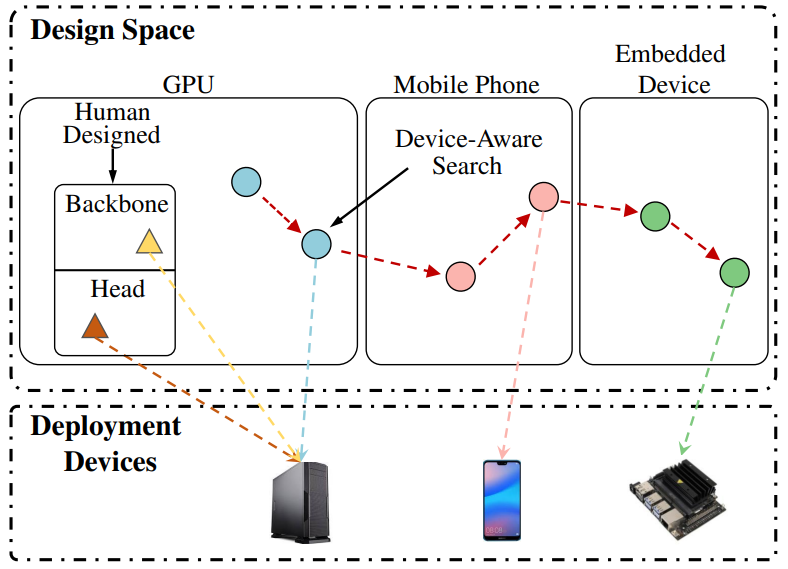
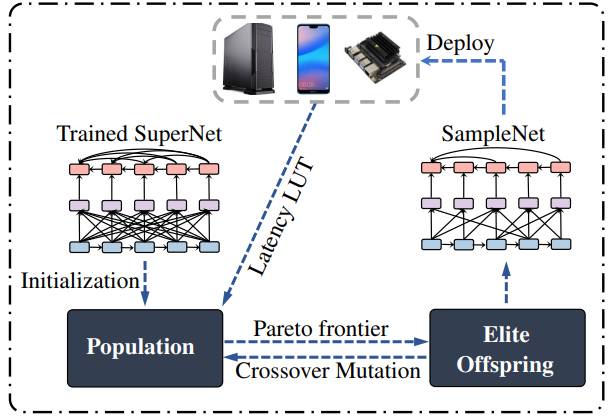
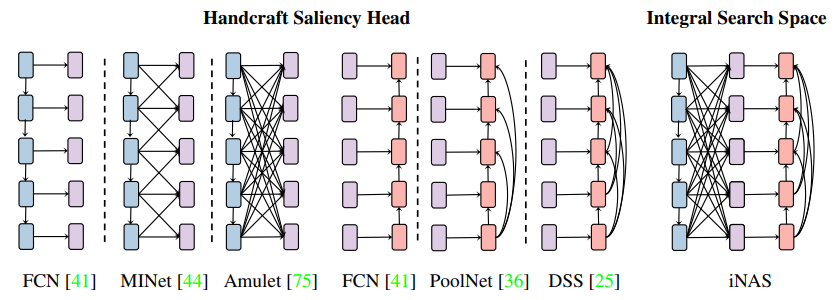
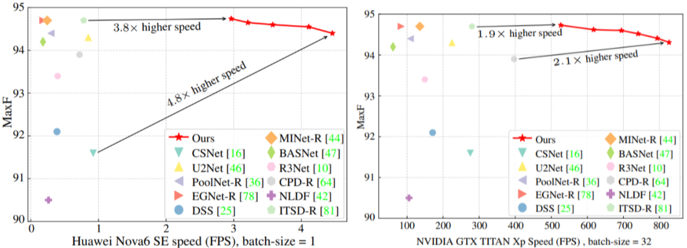
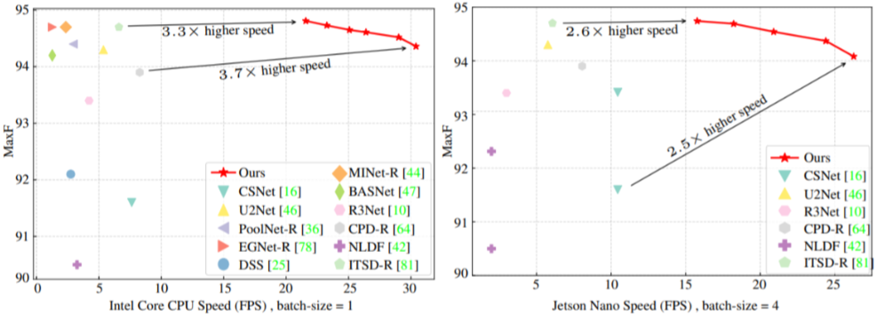

# iNAS: Integral NAS for Device-Aware Salient Object Detection

## Introduction

**Integral search design (jointly consider backbone/head structures, design/deploy devices).**

---

<div align="center">
   
</div>


**Covers mainstream handcraft saliency head design.**
<div align="center">
  
</div>

**SOTA performance with large latency reduction on diverse hardware platforms.**

---

<div align="center">
  
</div>

<div align="center">
  
</div>

## Updates

**0.2.0** was released in 15/11/2021:
- Support training on semantic segmentation task.
- Fix bugs in generating latency lookup table.
- Provide pre-trained model for cityscape datasets.

Please refer to [changelog.md](docs/changelog.md) for details and release history.


## Dependencies and Installation

**Dependencies**

- Python >= 3.7 (Recommend to use [Anaconda](https://www.anaconda.com/download/#linux) or [Miniconda](https://docs.conda.io/en/latest/miniconda.html))
- [PyTorch >= 1.7](https://pytorch.org/)
- NVIDIA GPU + [CUDA](https://developer.nvidia.com/cuda-downloads)

**Install from a local clone**

1. Clone the repo

    ```bash
    git clone https://github.com/guyuchao/iNAS.git
    ```

2. Install dependent packages

    ```bash
    conda create -n iNAS python=3.8
    conda install -c pytorch pytorch=1.7 torchvision cudatoolkit=10.2
    pip install -r requirements.txt
    ```

3. Install iNAS<br>
    Please run the following commands in the **iNAS root path** to install iNAS:<br>

    ```bash
    python setup.py develop
    ```

## Dataset Preparation

**Folder Structure**

```
iNAS
├── iNAS
├── experiment
├── scripts
├── options
├── datasets
│   ├── saliency
│   │   ├── DUTS-TR/            # Contains both images (.jpg) and labels (.png).
│   │   ├── DUTS-TR.lst         # Specify the image-label pair for training or testing.
│   │   ├── ECSSD/
│   │   ├── ECSSD.lst
│   │   ├── ...
│   ├── cityscape
│   │   ├── leftImg8bit/train
│   │   ├── leftImg8bit/val
│   │   ├── gtFine/
│   │   ├── train.txt
│   │   ├── val.txt
│   │   ├── ...
```
**Common Image SOD Datasets**

We provide a list of common salient object detection datasets.
<table>
<tr>
    <th>Name</th>
    <th>Datasets</th>
    <th>Short Description</th>
    <th>Download</th>
</tr>
<tr>
    <td rowspan="1">SOD Training</td>
    <td>DUTS-TR</td>
    <td><sub>10553 images for SOD training</sub></td>
    <td rowspan="9"><a href="https://drive.google.com/file/d/1Put-5roLAwuGU9gJBdY8fMEZKC9XjJfH/view?usp=sharing">Google Drive</a> / <a href="https://pan.baidu.com/s/1qxCgh4sFV_KnRQs1jMQ7hQ">Baidu Drive (psd: w69q)</a></td>
</tr>
<tr>
    <td rowspan="5">SOD Testing</td>
    <td>ECSSD</td>
    <td><sub>1000 images for SOD testing</sub></td>
</tr>
<tr>
    <td>DUT-OMRON</td>
    <td><sub>5168 images for SOD testing</sub></td>
</tr>
<tr>
    <td>DUTS-TE</td>
    <td><sub>5019 images for SOD testing</sub></td>
</tr>
<tr>
    <td>HKU-IS</td>
    <td><sub>4447 images for SOD testing</sub></td>
</tr>
<tr>
    <td>PASCAL-S</td>
    <td><sub>850 images for SOD testing</sub></td>
</tr>
</table>

**Common Image Semantic Segmentation Datasets**

We provide a list of common image semantic segmentation datasets.
<table>
<tr>
    <th>Name</th>
    <th>Datasets</th>
    <th>Short Description</th>
    <th>Download</th>
</tr>
<tr>
    <td rowspan="1">Training</td>
    <td>Cityscape-Train</td>
    <td><sub>2975 images for semantic segmentation training</sub></td>
    <td rowspan="2"> <a href="https://pan.baidu.com/s/1AbvacJkEXgcsPTMJ1eSmDA">Baidu Drive (psd: weiz)</a></td>
</tr>
<tr>
    <td rowspan="1">Validation</td>
    <td>Cityscape-Val</td>
    <td><sub>500 images for semantic segmentation validation</sub></td>
</tr>
</table>

## How to Use

The iNAS integrates four main steps of one-shot neural architecture search:
- Train supernet: Provide a fast performance evaluator for searching.
- Search models: Find a pareto frontier based on performance evaluator and resource evaluator.
- Convert weight/Retrain/Finetune: Promote searched model performance to its best. (We now support converting supernet weight to stand-alone models without retraining.)
- Deploy: Test stand-alone models.

Please see [Tutorial.md](docs/Tutorial.md) for the basic usage of those steps in iNAS.

## Model Zoo

### Task 1: Salient Object Detection

---

#### Trained supernet

| iNAS Supernet | training iteration | horizontal flip | ECSSD Fm@biggest | ECSSD Fm@smallest | download    |
|:--------------:|:----------------:|:----:|:----:|:----:|:----:|
| paper | 26400 (100 epoch)  | No  | 0.948 | 0.940 |  |
| iNAS_SOD_100e_noaug | 26400 (100 epoch)  | No  |  0.952  |  0.942  | [Google Drive](https://drive.google.com/drive/folders/1rKzV2u4VDdydk24Yv8dfnxkQ9OErduPy?usp=sharing) / [Baidu Drive (11tn)](https://pan.baidu.com/s/1kUPj8e2gfI5uekxRCbjVFQ)|
| iNAS_SOD_100e_aug   | 26400 (100 epoch)  | Yes | 0.954 | 0.945 | [Google Drive](https://drive.google.com/drive/folders/1rKzV2u4VDdydk24Yv8dfnxkQ9OErduPy?usp=sharing) / [Baidu Drive (5ktg)](https://pan.baidu.com/s/1forUEvr2QO302G-KDUpuaA)|
| iNAS_SOD_200e_aug   | 52700 (200 epoch)  | Yes | 0.955 |  0.948  | [Google Drive](https://drive.google.com/drive/folders/1ggl3JXQ1GEqbwRuqDFbw-iAAXvWBHPAG?usp=sharing) / [Baidu Drive (vp8q)](https://pan.baidu.com/s/1XuHwyIqG74xfvVSxHqGZBA)|

#### Searched models on Intel Core CPU

<table>
<tr>
    <th>iNAS Specialized Sub-nets </th>
    <th>ECSSD Fm/MAE</th>
    <th>#Params</th>
    <th>#Flops</th>
    <th>#Latency@CPU</th>
    <th>Download</th>
</tr>
<tr>
    <td style="text-align:center; font-weight:bold"> Handcraft Models </td>
    <td style="text-align:center"> </td>
    <td style="text-align:center"> </td>
    <td style="text-align:center"> </td>
    <td style="text-align:center"> </td>
    <td rowspan="5">We provide a speed benchmark of handcraft models and you can download it from <a href="https://drive.google.com/file/d/1Snb0tCFxbZZS8nWuKOuNx_G3wI7w8m-G/view?usp=sharing">Google Drive</a> / <a href="https://pan.baidu.com/s/1ywKVEgtXyn_6l81ExyixeA">Baidu Drive (b34c)</a>.</td>
</tr>
<tr>
    <td style="text-align:center"> EGNet-R (ICCV19) </td>
    <td style="text-align:center"> 0.947/0.037 </td>
    <td style="text-align:center"> 111.64M </td>
    <td style="text-align:center"> 120.85G </td>
    <td style="text-align:center"> 791.95ms </td>
</tr>
<tr>
    <td style="text-align:center"> ITSD-R (CVPR20) </td>
    <td style="text-align:center"> 0.947/0.034 </td>
    <td style="text-align:center"> 26.47M </td>
    <td style="text-align:center"> 9.65G </td>
    <td style="text-align:center"> 151.51ms </td>
</tr>
<tr>
    <td style="text-align:center"> CSNet (ECCV20) </td>
    <td style="text-align:center"> 0.916/0.065 </td>
    <td style="text-align:center"> 0.14M </td>
    <td style="text-align:center"> 0.72G </td>
    <td style="text-align:center"> 131.11ms</td>
</tr>
<tr>
    <td style="text-align:center"> U2-Net (PR20) </td>
    <td style="text-align:center"> 0.943/0.041 </td>
    <td style="text-align:center"> 1.13M </td>
    <td style="text-align:center"> 9.77G </td>
    <td style="text-align:center"> 186.53ms </td>
</tr>
<tr>
    <td style="text-align:center; font-weight:bold"> Supernet: iNAS_SOD_100e_noaug</td>
    <td style="text-align:center"> </td>
    <td style="text-align:center"> </td>
    <td style="text-align:center"> </td>
    <td style="text-align:center"> </td>
    <td rowspan="5">Models and logs can be downloaded from <a href="https://drive.google.com/drive/folders/1DjB9xPDMwAnrQQHoc2RDVG7grTQ67C6J?usp=sharing">Google Drive</a> / <a href="https://pan.baidu.com/s/1ForIlqNJj7YDqDRR9SC3gg">Baidu Drive (jgg3).</a></td>
</tr>
<tr>
    <td style="text-align:center">CPU_lat@27.00ms_Fmeasure@0.9437</td>
    <td style="text-align:center">0.943/0.036</td>
    <td style="text-align:center">5.09M</td>
    <td style="text-align:center">0.45G</td>
    <td style="text-align:center">29.97ms</td>
</tr>
<tr>
    <td style="text-align:center">CPU_lat@30.42ms_Fmeasure@0.9462</td>
    <td style="text-align:center">0.946/0.034</td>
    <td style="text-align:center">5.83M</td>
    <td style="text-align:center">0.58G</td>
    <td style="text-align:center">33.03ms</td>
</tr>
<tr>
    <td style="text-align:center">CPU_lat@35.76ms_Fmeasure@0.9493</td>
    <td style="text-align:center">0.949/0.034</td>
    <td style="text-align:center">8.15M</td>
    <td style="text-align:center">0.69G</td>
    <td style="text-align:center">38.74ms</td>
</tr>
<tr>
    <td style="text-align:center">CPU_lat@45.55ms_Fmeasure@0.9522</td>
    <td style="text-align:center">0.952/0.031</td>
    <td style="text-align:center">13.44M</td>
    <td style="text-align:center">0.85G</td>
    <td style="text-align:center">49.26ms</td>
</tr>
<tr>
    <td style="text-align:center; font-weight:bold"> Supernet: iNAS_SOD_200e_aug</td>
    <td style="text-align:center"> </td>
    <td style="text-align:center"> </td>
    <td style="text-align:center"> </td>
    <td style="text-align:center"> </td>
    <td rowspan="5">Models and logs can be download from <a href="https://drive.google.com/drive/folders/1epKOruGhfyfU2ECZniTa2o8VlKPoMl3q?usp=sharing">Google Drive</a> / <a href="https://pan.baidu.com/s/1jz9_X-p4M7jF6nC3hY_6yw">Baidu Drive (x60e)</a>.</td>
</tr>
<tr>
    <td style="text-align:center">CPU_lat@26.99ms_Fmeasure@0.9487</td>
    <td style="text-align:center; font-weight:bold">0.949/0.034</td>
    <td style="text-align:center">5.15M</td>
    <td style="text-align:center">0.48G</td>
    <td style="text-align:center; font-weight:bold">29.08ms</td>
</tr>
<tr>
    <td style="text-align:center">CPU_lat@34.80ms_Fmeasure@0.9520</td>
    <td style="text-align:center">0.952/0.032</td>
    <td style="text-align:center">7.48M</td>
    <td style="text-align:center">0.65G</td>
    <td style="text-align:center">37.35ms</td>
</tr>
<tr>
    <td style="text-align:center">CPU_lat@40.84ms_Fmeasure@0.9540</td>
    <td style="text-align:center">0.954/0.031</td>
    <td style="text-align:center">9.23M</td>
    <td style="text-align:center">0.75G</td>
    <td style="text-align:center">44.20ms</td>
</tr>
<tr>
    <td style="text-align:center">CPU_lat@59.10ms_Fmeasure@0.9560</td>
    <td style="text-align:center; font-weight:bold">0.956/0.030</td>
    <td style="text-align:center">16.29M</td>
    <td style="text-align:center">1.08G</td>
    <td style="text-align:center; font-weight:bold">61.88ms</td>
</tr>
</table>

#### Searched models on Mobile Phone: coming soon
#### Searched models on GPU: coming soon
#### Searched models on Embedded Device: coming soon

---


### Task 2: Semantic Segmentation

---

#### Trained supernet

| iNAS Supernet | training iteration | Cityscape Val mIOU@biggest | Cityscape Val mIOU@smallest | download    |
|:--------------:|:----------------:|:----:|:----:|:----:|
| iNAS_cityscape_8gpu_b3_120k_syncbn | 120K |  78.8  |  73.2 | [Google Drive](https://drive.google.com/drive/folders/1zt1MtNKuBvcugqi51CRnm1Mj1lJHpAjI?usp=sharing) / [Baidu Drive (lr00)](https://pan.baidu.com/s/1sjEbHzdtjRr8cp54Tv8oAw)|

#### Searched models on Intel Core CPU

<table>
<tr>
    <th>iNAS Specialized Sub-nets </th>
    <th>Cityscape Val (mIOU)</th>
    <th>#Params</th>
    <th>#Flops</th>
    <th>#Latency@CPU</th>
    <th>Download</th>
</tr>
<tr>
    <td style="text-align:center; font-weight:bold"> Handcraft Models </td>
    <td style="text-align:center"> </td>
    <td style="text-align:center"> </td>
    <td style="text-align:center"> </td>
    <td style="text-align:center"> </td>
    <td rowspan="3"> Coming Soon. </td>
</tr>
<tr>
    <td style="text-align:center"> ICNet (ECCV18) </td>
    <td style="text-align:center"> 67.7 </td>
    <td style="text-align:center"> - </td>
    <td style="text-align:center"> 28.3G </td>
    <td style="text-align:center"> - </td>
</tr>
<tr>
    <td style="text-align:center"> SwiftNet (CVPR19) </td>
    <td style="text-align:center"> 75.4 </td>
    <td style="text-align:center"> - </td>
    <td style="text-align:center"> 104G </td>
    <td style="text-align:center"> - </td>
</tr>
<tr>
    <td style="text-align:center; font-weight:bold"> NAS Methods </td>
    <td style="text-align:center"> </td>
    <td style="text-align:center"> </td>
    <td style="text-align:center"> </td>
    <td style="text-align:center"> </td>
    <td rowspan="4"> Coming Soon. </td>
</tr>
<tr>
    <td style="text-align:center"> DF1-Seg-d8 (CVPR19) </td>
    <td style="text-align:center"> 72.4 </td>
    <td style="text-align:center"> - </td>
    <td style="text-align:center"> - </td>
    <td style="text-align:center"> - </td>
</tr>
<tr>
    <td style="text-align:center"> MobileNetV3 (ICCV19) </td>
    <td style="text-align:center"> 72.4 </td>
    <td style="text-align:center"> - </td>
    <td style="text-align:center"> 9.1G </td>
    <td style="text-align:center"> - </td>
</tr>
<tr>
    <td style="text-align:center"> FasterSeg (ICLR20) </td>
    <td style="text-align:center"> 73.1 </td>
    <td style="text-align:center"> - </td>
    <td style="text-align:center"> 28.2G </td>
    <td style="text-align:center"> - </td>
</tr>
<tr>
    <td style="text-align:center; font-weight:bold"> Supernet: iNAS_cityscape_8gpu_b3_120k_syncbn </td>
    <td style="text-align:center"> </td>
    <td style="text-align:center"> </td>
    <td style="text-align:center"> </td>
    <td style="text-align:center"> </td>
    <td rowspan="1"> Coming Soon.</td>
</tr>
</table>

## TODO List

- [ ] Support multi-processing search (simply use data-parallel cannot increase search speed).
- [ ] Complete documentations.
- [ ] Add speed benchmark on semantic segmentation.

## Citation

If you find this project useful in your research, please consider cite:

```BibTeX
@inproceedings{gu2021inas,
  title={iNAS: Integral NAS for Device-Aware Salient Object Detection},
  author={Gu, Yu-Chao and Gao, Shang-Hua and Cao, Xu-Sheng and Du, Peng and Lu, Shao-Ping and Cheng, Ming-Ming},
  booktitle={Proceedings of the IEEE/CVF International Conference on Computer Vision},
  pages={4934--4944},
  year={2021}
}
```

## License
This work is licensed under a
[Creative Commons Attribution-NonCommercial-ShareAlike 4.0 International License (cc-by-nc-sa)](https://creativecommons.org/licenses/by-nc-sa/4.0/), where only
non-commercial usage is allowed. For commercial usage, please contact us.

## Acknowledgement
The project structure is borrowed from [BasicSR](https://github.com/xinntao/BasicSR), and parts of implementation and evaluation codes are borrowed from [Once-For-All](https://github.com/mit-han-lab/once-for-all), [BASNet](https://github.com/xuebinqin/BASNet) and [BiSeNet
](https://github.com/CoinCheung/BiSeNet). Thanks for these excellent projects.

## Contact
If you have any questions, please email `ycgu@mail.nankai.edu.cn`.
